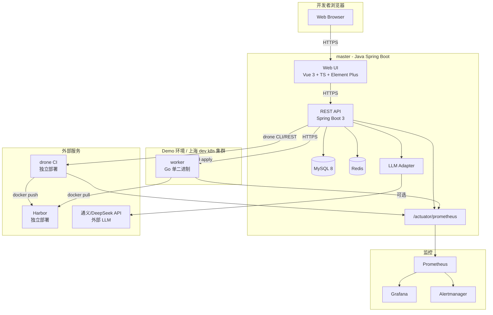

# master — Architecture

> **这是 stub 版本。** 完整架构细节见 [Design Spec §3](superpowers/specs/2026-08-08-platform-design.md#3-架构总览)。M1 完成后随每个 milestone 更新。

---

## 30-Second Overview

master is a **master-worker** architecture for unified build & deploy:

```
Browser → master (Java + Spring Boot) → drone CI / Harbor → worker (Go) → k8s
```

- **master**: single pane of glass. Web UI, REST API, AI assistance, business logic.
- **drone CI**: build engine (called by master via REST).
- **Harbor**: image registry (drone pushes here, worker pulls from here).
- **worker**: per-environment deployment agent (Go binary, in-cluster).
- **k8s**: deployment target (one cluster per environment).

---

## 5-Layer Mental Model

| Layer | Component | Responsibility |
|---|---|---|
| 1. **Presentation** | Vue 3 + Element Plus | Web UI |
| 2. **Application** | Java 21 + Spring Boot 3.2 (master) | Business logic, API, AI orchestration |
| 3. **Data** | MySQL 8 + Redis | Persistent state + cache + locks |
| 4. **Build Engine** | drone CI | Build, test, image push |
| 5. **Deploy Engine** | Go worker (in-cluster) | Pull image, apply deployment |

Cross-cutting:
- **AI**: Tongyi/DeepSeek LLM (or mock default) for pipeline gen / diagnosis / decision
- **Observability**: Prometheus /metrics on all components, Alertmanager for alerts

---

## Key Architectural Decisions

The full design spec has 23 decisions documented. Highlights:

1. **Master-worker with per-environment isolation** — each environment is its own k8s cluster, worker runs in-cluster
2. **drone CI as build engine** — master calls drone via REST, drone UI hidden
3. **Snapshot-based deployment** — every deploy records full yaml, rollback to any version
4. **AI assistance at 3 pressure points** — pipeline generation, failure diagnosis, release decision
5. **Java 21 + virtual threads** — perfect for I/O-bound master (drone/worker/LLM/SSE)
6. **Repository abstraction** — interface defined, GitLab V1, Gitee stub (first issue)
7. **Property-based testing on snapshot assembly** — handles special characters in envvars

See [the full spec](superpowers/specs/2026-08-08-platform-design.md) for details.

---

## Component Diagram



---

## Data Flow (Build)

1. User triggers build via Web UI
2. master calls `drone build create` with vars.yaml (env vars decrypted)
3. drone clones repo, runs pipeline (build → test → docker build → push to Harbor)
4. drone webhooks master on success/failure
5. master persists build record + image tag

For real-time logs, master opens SSE stream to drone, forwards to Web UI via EventSource. Logs persisted to MySQL on completion.

---

## Data Flow (Deploy)

1. User clicks "Deploy to demo-env" on a successful build
2. master composes full deployment snapshot yaml (image + envvars + replicas + probes)
3. master writes `deploy_record(snapshot_yaml=完整 yaml)`
4. master calls worker via HTTPS (token-authenticated)
5. worker `kubectl apply` the snapshot in-cluster
6. worker reports pod status every 5s for 5 minutes (deploy succeed check)
7. master updates `deploy_record.status` + sends alert

Rollback is the same flow but with a historical `deploy_record.snapshot_yaml`.

---

## Tech Stack

| Layer | Tech |
|---|---|
| master backend | Java 21 LTS + Spring Boot 3.2+ (virtual threads) |
| master frontend | Vue 3.4+ + TypeScript + Element Plus + Pinia |
| DB | MySQL 8 |
| Cache/Lock | Redis 7 |
| Build engine | drone CI 1.x |
| Image registry | Harbor 2.x |
| Worker | Go 1.22+ (single binary, scratch image) |
| Deployment target | Kubernetes 1.27+ (k3s for demo) |
| LLM | Tongyi/DeepSeek API (mock default) |
| Observability | Prometheus + Grafana + Alertmanager |
| Testing | JUnit 5 + Mockito + Testcontainers + jqwik + Vitest + Playwright |

---

## Where to Read Next

- [Full design spec](superpowers/specs/2026-08-08-platform-design.md) (35KB, 23 decisions, 8 Mermaid diagrams)
- [Implementation plan](superpowers/plans/2026-08-08-platform-implementation.md) (16 milestones, 5-6 weeks)
- [8 core page wireframes](superpowers/wireframes/index.html) (open in browser)

---

> **Last updated**: M1 (Repository skeleton)
> **Next update**: M2 (Master backend skeleton) will add Spring Boot project structure
