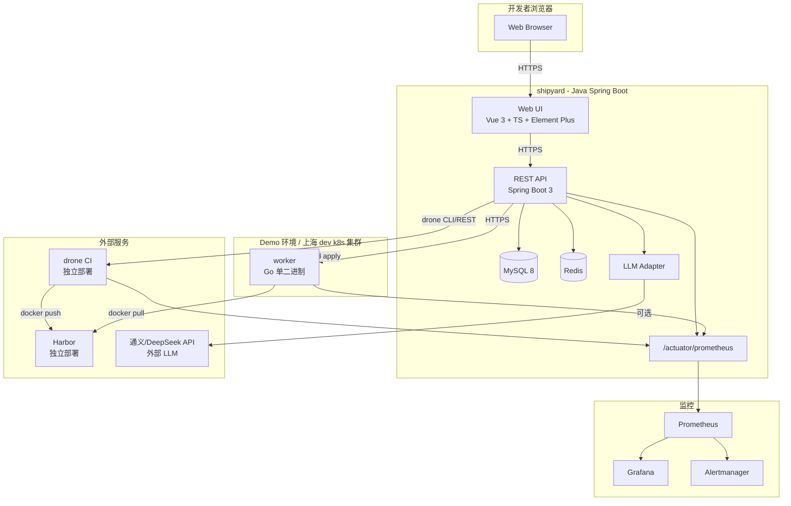
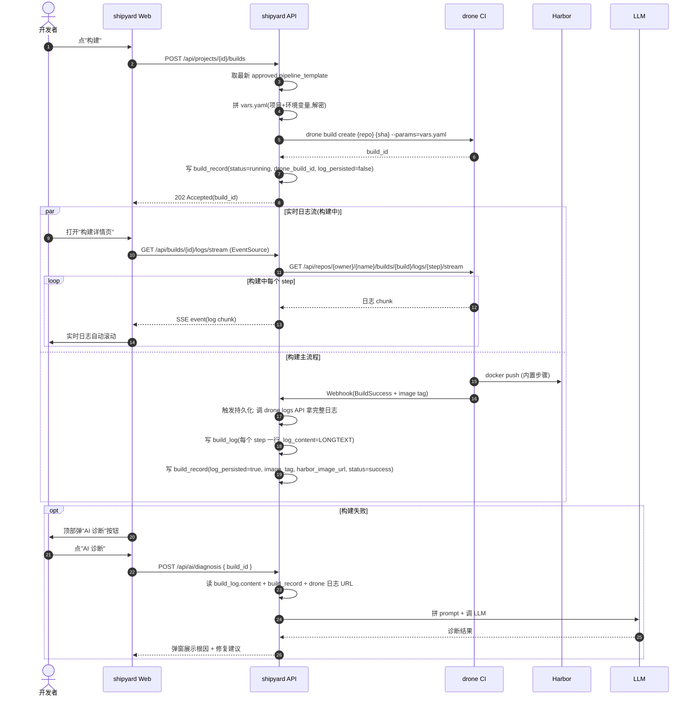
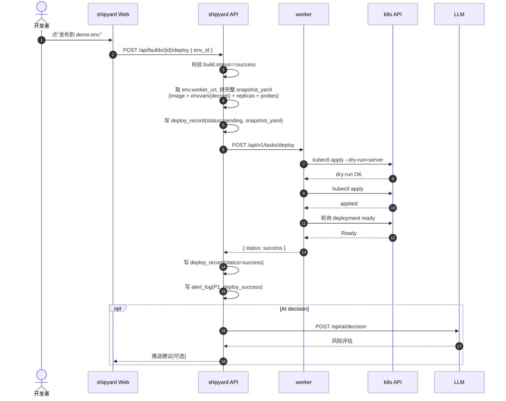
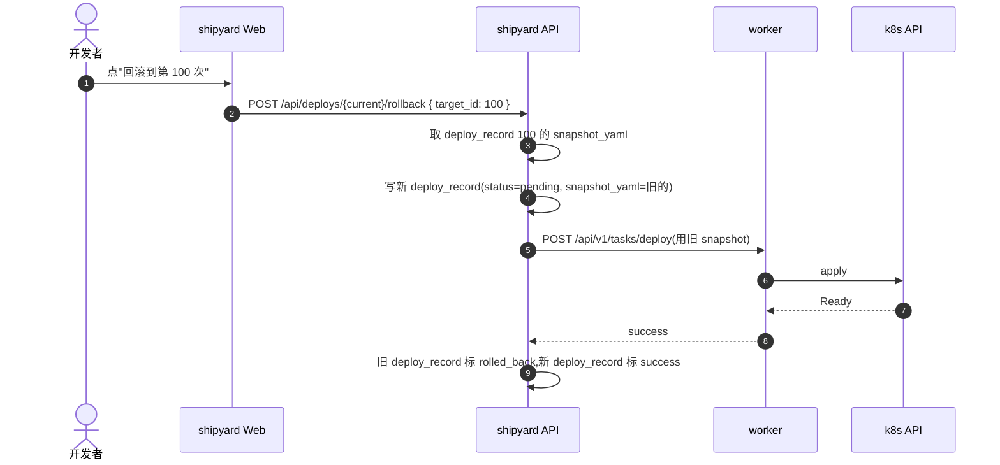
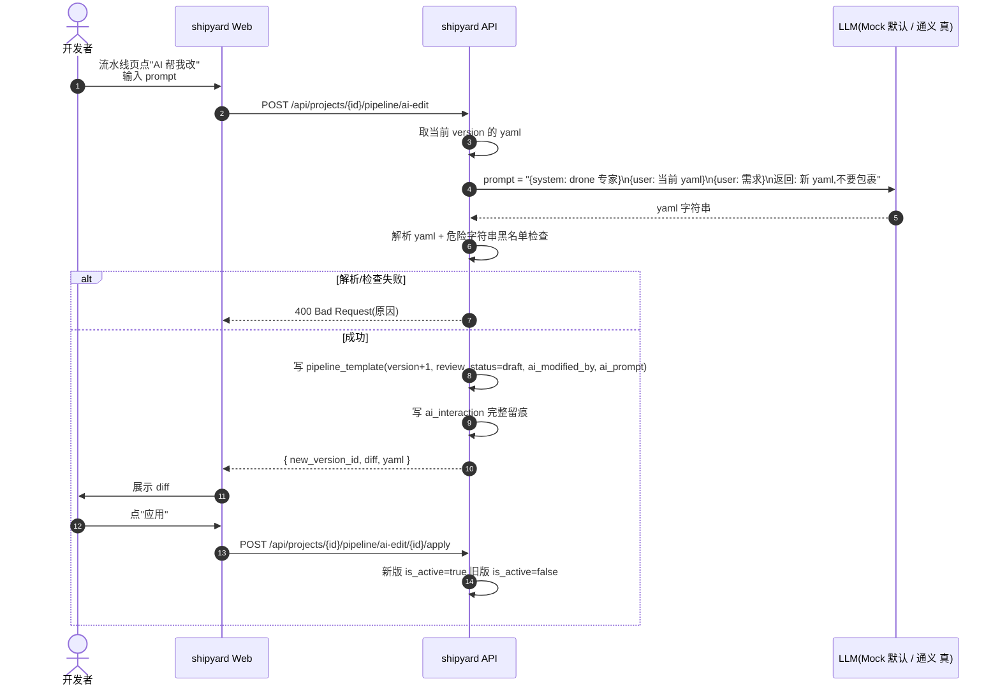
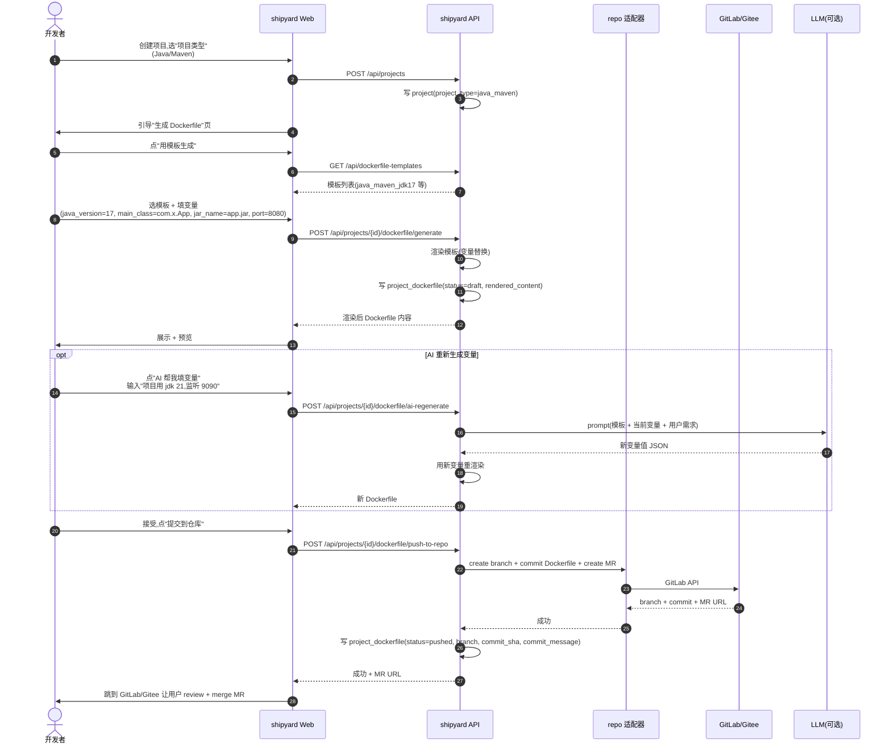

# 统一构建发布平台 — 设计 Spec

| 字段 | 值 |
|---|---|
| 版本 | 0.1.0 |
| 创建日期 | 2026-08-08 |
| 作者 | 仔哥 + Mavis |
| 状态 | 待 review |
| 目标 V1 里程碑 | 横向 demo：Java 应用端到端 build → push → deploy → rollback + AI 三能力基础版 |

---

## 1. 概述

### 1.1 项目背景

复刻上家公司的内部统一发布平台。该平台用于：
- 多语言应用的**构建**（Java / Vue / React / Python 等）
- 多环境的**发布**（上海 dev / 上海 test / 上海正式 等）
- 提供 shipyard-worker 架构，worker 部署在每个环境执行实际拉镜像、部署操作
- 基于 drone CI 做构建，K8s 做部署运行时
- 制品仓库使用 Harbor
- 监控告警走 Prometheus + Alertmanager
- 集成 AI 能力（流水线生成 / 故障诊断 / 发布决策）

### 1.2 核心定位

**内部 DevOps 平台**，shipyard 是统一门面，drone / Harbor / worker 都是后端引擎，用户只看到 shipyard。

### 1.3 关键约束

| 约束 | 含义 |
|---|---|
| **开源** | 仓库公开在 GitHub，代码经得起社区审阅，无内部凭证/URL/域名泄露 |
| **面试项目** | 架构亮点能在 5 分钟讲清楚，可量化（覆盖 N 个模块、X 个端到端测试、Y% 覆盖率），有 demo 视频 |
| **V1 范围：横向 demo 优先** | 第一个里程碑完成"Java 应用端到端可演示"，再扩多环境、多仓库平台、深监控 |
| **权限 V1 不做** | 用白名单 + JWT 暂代，V1.5 再扩 RBAC |
| **审批流后续接入** | V1 不做审批节点，V1.5 加上 |
| **告警先 log 后 webhook** | V1 阶段 alert 写 log + UI 展示，V1.5 再接飞书/钉钉 webhook |

---

## 2. 范围

### 2.1 V1 范围（横向 demo，3-4 周主体 + 1-2 周 demo 编排）

**端到端可演示链路**：
1. shipyard Web UI 创建项目（关联一个 Java 仓库）
2. AI 改/生成流水线（mock LLM 默认开启）
3. 触发构建 → drone 构建 → 推 Harbor
4. 发布到"上海 dev"环境（demo 阶段用本地 k3s 集群模拟）
5. AI 故障诊断（演示：故意制造失败场景）
6. AI 发布决策（演示：构建完成后给风险评估）
7. 手动回滚到任一历史 snapshot
8. 监控指标通过 Prometheus 暴露，Grafana 看 dashboard
9. `make demo` 一键拉起完整链路

**应用类型支持**（V1 仅 Java 端到端）：
- Java 后端（Maven/Gradle + Jib 打 Docker 镜像）
- Vue/React/Python 仅在流水线模板中预留支持位（不强 E2E）

**仓库平台**（V1）：
- 实现 **GitLab 适配器**（完整）
- 设计 **repo 抽象层**（interface + factory）
- Gitee 适配器是空 stub（"未实现"），作为开源 first-issue

**LLM 模式**（V1）：
- 默认 **MockLLMAdapter**（返回预制数据）
- 配置 `TONGYI_API_KEY` 或 `DEEPSEEK_API_KEY` 后切真 LLM
- 三个能力都走同一适配器

**环境**（V1 demo 阶段）：
- 1 个环境（demo 阶段叫"demo-env"，用本地 k3s 集群）
- V1.5 再加"上海 dev / test / 正式"标准多环境

**Dockerfile 自动生成**（V1）：
- shipyard 自带 4-5 套主流 Dockerfile 模板（Java/Maven、Java/Gradle、Node/pnpm、Python/poetry 等）
- 建项目时选"项目类型" → shipyard 根据模板 + 项目元数据生成 Dockerfile → **commit 进项目仓库**（shipyard 用 repo 适配器写文件 + 创建分支 + 提 MR/PR）
- 模板用变量占位（`${java_version}`、`${main_class}`、`${jar_name}`、`${port}` 等）
- 用户能在 UI 上 review 生成的 Dockerfile → 接受 / 手动改 / 拒绝
- AI 改流水线时也能触发"重新生成 Dockerfile"（用户改需求时 AI 同步调整模板变量 + 重新生成）
- V1.5 加上"用户自维护 Dockerfile 模板"能力（fork shipyard 自带模板改自己用）

**实时构建日志**（V1）：
- 构建过程中**实时**看构建日志（SSE 流式推到前端），不用等构建完
- 构建完成后日志**持久化到 shipyard MySQL**（按 step 分行存），以后从 shipyard 直接看不用跳 drone
- shipyard Web "构建详情页"：左侧元信息（commit / trigger / 耗时 / step 列表），右侧实时日志区（自动滚到底）
- 失败时顶部自动出现"AI 诊断"按钮（一键分析失败原因）
- 历史日志查询：shipyard MySQL 有就直接返回，没有则 fallback 调 drone logs API
- drone 那边只存 30 天（drone 默认），shipyard 这边永久保留（V1.5 加日志保留策略）

### 2.2 V1.5 范围

- 多环境（上海 dev / test / 正式，独立 k8s 集群）
- Gitee 适配器实现（社区 PR 友好）
- 飞书/钉钉 webhook 出站（告警升级）
- 流水线 webhook 自动触发
- Vue/React/Python 端到端 E2E 测试
- 手动停止部署按钮
- 用户自维护 Dockerfile 模板（fork + 改 + 用）

### 2.3 V2 范围

- 完整 RBAC 权限
- 审批流（多级审批 + 灰度发布）
- 蓝绿/金丝雀发布（Argo Rollouts 集成）
- 私有部署 LLM
- 完整 Grafana dashboard + Alertmanager 升级规则

---

## 3. 架构总览

### 3.1 组件总览



### 3.2 关键选型

| 组件 | 选型 | 理由 |
|---|---|---|
| shipyard 后端 | **Java 21 LTS + Spring Boot 3.2+**（启用虚拟线程） | 团队技术栈、虚拟线程完美匹配 shipyard 的 I/O bound 场景 |
| shipyard 前端 | Vue 3 + TS + Element Plus | 国内主流、上手快 |
| DB | MySQL 8 | 公司默认栈 |
| 缓存/锁 | Redis | 构建状态缓存、分布式锁防重 |
| 消息队列 | **V1 不用** | YAGNI，同步 + Redis 锁顶住 100 并发 |
| worker | Go 单二进制 + scratch 镜像 | 镜像小（10MB）、跨集群分发快、启动快 |
| drone | 1.x 最新版 | 用户指定 |
| Harbor | 2.x 最新版 | 用户指定 |
| LLM | 通义千问 / DeepSeek API | 中文友好、便宜 |
| 监控 | Prometheus + Grafana + Alertmanager | 工业标准、复用生态 |
| 测试 | JUnit 5 + jqwik + Testcontainers + Vitest + Playwright | 见 §8 |
| 容器化 | Docker + docker-compose（开发） + k3s（demo 集群） | 跨平台、轻量 |

### 3.2.1 虚拟线程设计（Java 21）

shipyard 的请求路径**几乎全是 I/O bound**：

- 调 drone REST API（构建触发、状态查询、日志流）
- 调 worker HTTP API（部署、回滚、停止）
- 调 LLM Provider（外部 LLM 推理）
- 调 GitLab/Gitee API（仓库读写、MR 创建、commit diff）
- DB 查询（MySQL + MyBatis）
- Redis 操作（缓存 + 分布式锁）
- **SSE 实时日志推送**（长连接，每个 build 都占一个线程直到构建完成）

**传统线程池的问题**：默认 200 线程上限 + 每个线程 1MB 栈 → 高并发（100+ 同时构建）时线程耗尽，HTTP 502。

**虚拟线程的解法**：Project Loom（JDK 21 LTS GA）让每个虚拟线程只占几 KB 栈，**M 个虚拟线程跑在 N 个 OS 线程上**（M:N 调度）。shipyard 启动时一行配置启用，**所有阻塞 I/O 自动跑在虚拟线程上，不用改业务代码**。

**配置示例**（`application.yml`）：

```yaml
spring:
  threads:
    virtual:
      enabled: true   # Spring Boot 3.2+ 一行启用虚拟线程

server:
  tomcat:
    threads:
      # 不需要再配 max-threads,虚拟线程下 tomcat 用 VirtualThreadExecutor
      max: 200
```

**哪些场景直接受益**：

| 场景 | 传统线程池 | 虚拟线程 |
|---|---|---|
| 100 个并发构建触发（每个调 drone API 等几秒） | 占 100 线程 | 占 100 虚拟线程（只占几个 OS 线程） |
| SSE 实时日志推送（每个 build 1 个长连接） | **不能**长开，线程池耗尽 | 没问题，虚拟线程数可以万级 |
| LLM 调外部 API（每个 prompt 1-5s 阻塞） | 阻塞 OS 线程 | 阻塞虚拟线程，OS 线程继续服务其他请求 |
| MySQL/Redis I/O | 阻塞 OS 线程 | 阻塞虚拟线程 |

**虚拟线程的注意点**（V1 实施时要避免）：

1. **不要在 synchronized 块里做 I/O** —— synchronized 会 pin 住 carrier 线程，synchronized 里做阻塞 I/O 等于退化成 OS 线程。建议用 `ReentrantLock` 替代。
2. **不要池化虚拟线程** —— 虚拟线程不是稀缺资源，不要做"虚拟线程池"（即用即建即可）。
3. **JFR + JDK Flight Recorder** —— 监控虚拟线程行为，看是不是有 carrier pinning。

**对 worker 的影响**：worker 仍然是 Go 单二进制（CPU bound + k8s 客户端），不受 Java 21 虚拟线程影响。

**面试亮点**："为什么用 Java 21 不用 17？" → "虚拟线程，shipyard 全是 I/O bound，10 行配置让 100 并发构建不卡线程池"

### 3.3 部署拓扑

**V1 demo 形态**（开发机器上）：
```
docker-compose up
├── mysql
├── redis
├── shipyard (spring boot)
├── drone-server
├── drone-runner
├── harbor
├── k3s (单节点, 模拟 k8s 集群)
├── worker (部署进 k3s)
├── prometheus
└── grafana

git clone && make demo → 上面全部一键拉起
```

**V1.5 生产形态**：
```
shipyard: 2 副本, MySQL 主从, Redis Sentinel
drone-server: 1 副本, drone-runner × N (按构建压力扩)
Harbor: 主从, 跨可用区
每环境: 独立 k8s 集群, worker 2 副本
Prometheus: 联邦 / Thanos
```

---

## 4. shipyard 内部设计

### 4.1 核心数据模型（12 张表）

| 表 | 作用 | 关键字段 |
|---|---|---|
| `project` | 项目元数据 | id, name UNIQUE, display_name, repo_provider ENUM(gitlab/gitee), repo_url, repo_token_enc, default_branch, project_type ENUM(java_maven/java_gradle/node_pnpm/python_poetry/other), project_meta JSON (语言版本/主类/jar 名/端口等), description, created_at, updated_at |
| `pipeline_template` | 流水线模板 | id, project_id FK, version INT, yaml_content MEDIUMTEXT, review_status ENUM(draft/approved/rejected), is_active BOOL, created_by, ai_modified_by NULL, ai_prompt NULL, created_at |
| `dockerfile_template` | Dockerfile 模板（shipyard 自带） | id, name UNIQUE (如 java_maven_jdk17), display_name, language, build_tool, template_content MEDIUMTEXT (Mustache/Go template 语法含 `${var}`), variable_schema JSON (变量定义: key, type, default, description, required), version, is_builtin BOOL, created_at, updated_at |
| `project_dockerfile` | 项目 Dockerfile 实例 | id, project_id FK, dockerfile_template_id FK, rendered_content MEDIUMTEXT (渲染后), variable_values JSON, repo_branch, repo_commit_sha, commit_message, status ENUM(draft/pushed/rejected), created_at, pushed_at |
| `env` | 环境定义 | id, name UNIQUE, display_name, cluster_type ENUM(k8s), k8s_namespace, worker_url, worker_token_enc, is_production BOOL, created_at |
| `project_env` | 项目-环境关联 | project_id + env_id 复合主键 |
| `env_variable` | 环境变量 | id, env_id FK, project_id FK NULL, var_key, var_value_enc TEXT, is_secret BOOL, description, updated_by, updated_at, UNIQUE(env_id, project_id, var_key) |
| `build_record` | 构建记录 | id, project_id FK, pipeline_template_id FK, commit_sha, commit_message, triggered_by, trigger_type ENUM(manual/webhook/api), drone_build_id, status ENUM(pending/running/success/failed/timeout/canceled), image_tag, harbor_image_url, started_at, finished_at, log_url, **log_persisted BOOL** (日志是否已落 shipyard) |
| `build_log` | 构建日志（按 step 存） | id, build_record_id FK, step_name, step_order INT, **log_content LONGTEXT** (完整日志), log_size_bytes BIGINT, started_at, finished_at, created_at, UNIQUE(build_record_id, step_name) |
| `deploy_record` | 发布记录 | id, build_record_id FK, project_id FK, env_id FK, deploy_status ENUM(pending/running/success/failed/rolled_back), **snapshot_yaml MEDIUMTEXT** (回滚用), k8s_deployment_name, triggered_by, started_at, finished_at, log_url |
| `worker` | worker 注册 | id, env_id FK UNIQUE, worker_url, worker_token_hash, last_heartbeat_at, status ENUM(online/offline/unhealthy), version |
| `ai_interaction` | AI 对话留痕 | id, user_id, capability ENUM(pipeline_gen/diagnosis/decision), input_prompt TEXT, llm_provider, llm_model, llm_request JSON, llm_response JSON, output_action TEXT, created_at |
| `alert_log` | 告警记录（V1 不出站） | id, level ENUM(P0/P1/P2), event_type, message, context_json, status ENUM(open/acknowledged/resolved), created_at, resolved_at NULL |

**加密策略**：
- `repo_token_enc` / `var_value_enc` / `worker_token_enc` / `webhook_url_enc` 均 AES-256 加密存储
- 加密密钥启动时从 `application.yml` 读（V1）
- **envelope encryption 设计**：表里有 `key_id` 字段（V1.5 加），方便以后接 KMS 时只换 Encrypter 实现，不动业务代码
- 启动时全量校验变量完整性，启动失败列出损坏变量

### 4.2 关键 REST API

```
项目
  POST   /api/projects                  创建项目
  GET    /api/projects                  列表
  GET    /api/projects/{id}            详情
  PUT    /api/projects/{id}            更新
  DELETE /api/projects/{id}            删除

流水线
  GET    /api/projects/{id}/pipeline           当前生效版本
  GET    /api/projects/{id}/pipeline/history    历史版本列表
  POST   /api/projects/{id}/pipeline            新建版本
  PUT    /api/projects/{id}/pipeline/{ver}      更新版本内容
  POST   /api/projects/{id}/pipeline/{ver}/approve  审核(改 review_status=approved)
  POST   /api/projects/{id}/pipeline/ai-edit        AI 改入口(返回新 draft + diff)
  POST   /api/projects/{id}/pipeline/ai-edit/{id}/apply  用户确认应用(改 is_active=true)

Dockerfile 模板(shipyard 自带,只读列表)
  GET    /api/dockerfile-templates              列表
  GET    /api/dockerfile-templates/{id}         详情(含 variable_schema)

Dockerfile 生成
  POST   /api/projects/{id}/dockerfile/generate        body: { template_id, variable_values } 返回渲染后 Dockerfile
  POST   /api/projects/{id}/dockerfile/push-to-repo    body: { rendered_content, branch, commit_message } 提交进项目仓库
  GET    /api/projects/{id}/dockerfile                 当前生效 Dockerfile
  GET    /api/projects/{id}/dockerfile/history         历史版本
  POST   /api/projects/{id}/dockerfile/ai-regenerate   AI 重新生成(body: prompt, current_variable_values) → 返回新变量值 + 渲染后 Dockerfile

环境
  GET    /api/envs                       列表
  POST   /api/envs                       创建
  PUT    /api/envs/{id}                 更新
  GET    /api/envs/{id}/workers         worker 状态
  POST   /api/envs/{id}/workers/heartbeat  worker 主动心跳(V1 用 shipyard 主动 ping 也行)

变量
  GET    /api/envs/{id}/variables       列表
  POST   /api/envs/{id}/variables       创建
  PUT    /api/variables/{id}            更新
  DELETE /api/variables/{id}            删除

构建
  POST   /api/projects/{id}/builds      触发构建(body: branch, commit_sha 可选)
  GET    /api/projects/{id}/builds      构建历史
  GET    /api/builds/{id}               构建详情
  POST   /api/builds/{id}/cancel        取消

构建日志(实时 + 持久化)
  GET    /api/builds/{id}/logs/stream   SSE 实时流(构建中调,前端用 EventSource)
  GET    /api/builds/{id}/logs          完整日志(已持久化用,按 step 返回)
  GET    /api/builds/{id}/logs/steps    step 列表(step 名/顺序/状态/开始时间)
  GET    /api/builds/{id}/logs/steps/{step_id}  单 step 完整日志
  POST   /api/builds/{id}/logs/persist  手动触发持久化(正常情况 webhook 自动触发,失败时可手动)

发布
  POST   /api/builds/{id}/deploy        发布(body: env_id)
  GET    /api/projects/{id}/deploys     发布历史
  GET    /api/deploys/{id}              发布详情
  POST   /api/deploys/{id}/rollback     回滚(body: target_deploy_record_id)
  POST   /api/deploys/{id}/stop         停止卡住的部署(manual abort)

AI
  POST   /api/ai/pipeline-gen           AI 生成/改流水线
  POST   /api/ai/diagnosis              AI 故障诊断(body: deploy_id 或 build_id)
  POST   /api/ai/decision               AI 发布决策建议(body: deploy_id)

监控
  GET    /actuator/health               健康检查
  GET    /actuator/prometheus           /metrics 端点
  GET    /api/metrics/summary           UI 用,聚合指标
  GET    /api/alerts?level=&since=      alert_log 列表
  POST   /api/alerts/{id}/ack           确认告警
  POST   /api/alerts/{id}/resolve       关闭告警
```

### 4.3 内部模块依赖

```mermaid
flowchart LR
    Project["project"]
    Pipeline["pipeline"]
    Dockerfile["dockerfile<br/>模板+渲染+提交"]
    Env["env"]
    Variable["variable"]
    Repo["repo<br/>GitLab/Gitee adapter"]
    Build["build"]
    Deploy["deploy"]
    AI["ai<br/>LLM adapter"]
    Monitor["monitor<br/>/actuator/prometheus"]
    Notify["notification<br/>webhook 出站 V1.5"]
    Crypto["crypto<br/>AES Encrypter"]
    Worker["worker<br/>调度客户端"]

    Build --> Repo
    Build --> Pipeline
    Build --> Env
    Build --> Variable
    Build --> Crypto
    Deploy --> Env
    Deploy --> Worker
    Deploy --> Build
    Deploy --> Variable
    Deploy --> Crypto
    AI --> LLM[("LLM Provider")]
    Pipeline --> AI
    Dockerfile --> Template[("dockerfile_template<br/>shipyard 自带")]
    Dockerfile --> Repo
    Dockerfile --> AI
    Monitor --> Metrics[("Micrometer")]
    Notify -.V1.5.-> Feishu["飞书/钉钉"]
    Variable --> Crypto
```

---

## 5. worker 设计

### 5.1 部署形态

- **语言**：Go 1.22+
- **构建**：单二进制 + scratch 镜像（仅含 ca-certificates + 二进制）
- **镜像大小**：~15MB
- **部署**：k8s Deployment, replicas=2 (高可用 + 滚动升级)
- **ServiceAccount**：最小权限，只对指定 namespace 有 `get/list/create/update/patch` 权限（针对 deployment, pod, replicaset）
- **不持久化任何状态**——所有信息从 shipyard 拿，重启无副作用

### 5.2 worker API 端点

```
POST /api/v1/tasks/deploy
  Body: { "deploy_record_id": 123, "snapshot_yaml": "..." }
  流程:
    1. 校验 deploy_record_id
    2. dry-run apply (kubectl apply --dry-run=server)
    3. 真 apply
    4. 轮询 deployment ready(超时 5min)
    5. 持续 report pod 状态回 shipyard (5s/次,直到 5min)
  返回: { "status": "success"|"failed", "k8s_deployment_name": "...", "error": {...} }

POST /api/v1/tasks/rollback
  Body: { "deploy_record_id": 123, "target_deploy_record_id": 100 }
  流程: 取 target 的 snapshot, 走 deploy 流程

POST /api/v1/tasks/stop
  Body: { "deploy_record_id": 123 }
  流程: kubectl rollout undo 或 scale deployment 0, 让卡住的 progressing 退出

GET  /healthz        K8s liveness probe
GET  /readyz         K8s readiness probe
GET  /metrics        Prometheus
```

### 5.3 关键设计原则

1. **不持久化状态** — 无 DB、无文件持久化、无内存缓存业务数据
2. **in-cluster ServiceAccount** — 不需要外部 kubeconfig
3. **任务执行用状态机** — worker 接任务前 shipyard 已用 deploy_record.status=pending 标记; worker 任务开始后改 running,完成改 success/failed
4. **失败原因结构化** — 返回 JSON `{ "code": "IMAGE_PULL_FAILED", "message": "...", "k8s_event": "..." }`,AI 故障诊断直接吃
5. **持续状态上报** — apply 成功后 5 分钟内每 5s 报一次 pod status,shipyard 检测 pod crashLoopBackOff 时通知用户

---

## 6. 端到端数据流

### 6.1 构建流


    API->>API: 写 build_record.image_tag + harbor_image_url
```

### 6.2 发布流



### 6.3 回滚流



### 6.4 AI 改流水线流



### 6.5 AI 故障诊断流

```
1. deploy/build 失败时 shipyard 自动触发,或用户手动 POST /api/ai/diagnosis { deploy_id }
2. shipyard 收集上下文:
   - build_record 完整字段 + drone 日志 URL
   - deploy_record 完整字段 + worker 日志 + k8s event
   - 最近 5 次发布记录(找 pattern)
3. shipyard 拼 prompt + 调 LLM
4. LLM 返回: { "root_cause": "...", "confidence": 0.7, "suggested_fixes": [...], "related_docs": [...] }
5. shipyard 写 ai_interaction 留痕
6. UI 弹窗展示(用户不采纳不影响业务)
```

### 6.6 AI 发布决策流

```
1. build 成功后 shipyard 主动触发(自动),或用户手动 POST /api/ai/decision { deploy_id }
2. shipyard 收集上下文:
   - 本次 commit diff(调 GitLab API)
   - build 测试报告 / 覆盖率
   - 最近 5 次发布成功率 + 平均恢复时间
3. shipyard 拼 prompt + 调 LLM
4. LLM 返回: { "risk_level": "low|medium|high", "risk_factors": [...], "recommendation": "可上|延后|先小流量" }
5. shipyard 写 ai_interaction 留痕
6. UI 在"发布"按钮旁展示建议(不强制,仅参考)
```

### 6.7 Dockerfile 生成流



**关键设计点**：

- **走 MR 而不是直接推 main** —— Dockerfile 是项目代码一部分,走 MR 让团队 review,跟正常代码一样
- **template 渲染用 Mustache 或 Go template** —— 标准语法,变量用 `${var}` 或 `{{var}}` 占位
- **变量 schema 定义在 `dockerfile_template.variable_schema`** —— 模板自带变量定义(type/default/required/description),前端按 schema 动态生成表单
- **AI 改变量不直接改文件** —— AI 改的是 `variable_values`,然后重新渲染模板。文件本身是确定性的(模板+变量=文件),AI 介入点是变量
- **失败兜底** —— push-to-repo 失败(GitLab 5xx / token 失效)→ 写 alert_log(P1),用户手动重试

---

## 7. 错误处理

### 7.1 失败场景表

| 失败场景 | 症状 | 检测 | 恢复策略 |
|---|---|---|---|
| **drone 推 webhook 丢失** | build 卡 running | shipyard 5min 没收到 drone 事件 | shipyard 30s/60s/2min/5min 退避轮询 `drone build info` 3 次;仍超时标 `timeout` |
| **drone server 整体挂** | 所有构建启动不了 | drone health check 失败 | shipyard 给 5xx 提示"drone 异常,联系管理员";构建状态保持 pending,**不标 failed**(避免误判) |
| **Harbor push 失败** | drone 成功但镜像没上去 | drone 日志有 Harbor push error | build_record 标 failed + 写 drone 日志 URL + UI 展示,用户手动重试 |
| **worker 不在线** | 发布请求超时 | 调用 worker API 超时 30s | shipyard 标 worker unhealthy;deploy_record 标 failed;提示"worker 离线,联系环境管理员" |
| **worker apply 失败** | k8s 拒绝 yaml | worker 返回结构化错误码 | deploy_record 标 failed + 错误信息;UI 弹"AI 诊断"建议 |
| **deploy 成功后 pod 启动失败** | Deployment 卡 progressing,**原应用不受影响** | worker 持续 report 5min,shipyard 检测 pod not ready | deploy_record 标 failed + pod reason/event;UI 展示详情 + "手动停止"按钮;用户点停止 → worker `kubectl rollout undo` 或 `scale deployment 0` |
| **AI 改 yaml 生成垃圾** | LLM 返回非法 yaml / 危险字符串 | shipyard 解析失败 / 危险字符串黑名单命中 | 拒收,不写 pipeline_template,提示用户重新描述;记 ai_interaction |
| **LLM API 不可用** | AI 功能 503 | shipyard 调 LLM 5s 超时 / 5xx | AI 按钮置灰 + 提示"AI 服务暂不可用";主链路不受影响 |
| **drone webhook 验签失败** | 收到伪造 webhook | HMAC 不匹配 | 丢弃,记 alert_log(P1);同一 IP 5/min 触发 P0 告警 |
| **env_variable 解密失败** | shipyard 启动失败 | 启动时按项目全量校验 | 启动失败 + 列出损坏变量;强制修复(防运行时才发现"为什么发布到一半 500") |
| **shipyard Redis 挂** | 分布式锁失效、缓存丢 | Redis ping 失败 | 主链路降级(不用锁,慢但能跑);P0 告警;不阻断业务 |
| **shipyard MySQL 挂** | 所有 API 500 | DB ping 失败 | 5xx + P0 告警;构建/发布能查历史但不能新操作 |

### 7.2 关键设计原则

1. **失败不自动重试** —— 默认所有失败都让用户/管理员手动重试。仅两个**显式偶发场景**做 1 次重试:drone webhook 丢失的轮询重试(§7.1 第一行)+ AI 失败 1 次重试(LLM 偶发 5xx/超时常见,1 次重试能覆盖 80%)。其他情况**不**自动重试——自动重试会让"幽灵任务"乱跑(用户以为失败,后台还在跑)
2. **失败原因结构化** —— 前端拿到 JSON 错误码(`IMAGE_PULL_FAILED` / `INVALID_YAML` / `POD_CRASH_LOOP`),针对性提示 + 给操作建议
3. **K8s 启动失败不自动回滚** —— 滚动更新策略下原应用不受影响,失败只需"记录 + 手动停止",不需要"自动回滚"(回滚到错误版本风险大)
4. **告警先 log 后 webhook** —— V1 写 alert_log + UI 展示,V1.5 接飞书/钉钉 webhook 出站

### 7.3 告警分级(V1)

| 级别 | 触发条件 | V1 行为 | V1.5 升级 |
|---|---|---|---|
| **P0** | shipyard 挂、MySQL 挂、worker 全离线、Redis 挂 | alert_log + UI 红点 | + 飞书/钉钉 webhook |
| **P1** | 单次 deploy 失败、构建失败、worker 离线、webhook 验签失败 | alert_log + 通知触发人 | + 飞书/钉钉 webhook |
| **P2** | AI 失败、Redis 抖、shipyard 慢响应 | alert_log(只 metric) | + 飞书/钉钉 webhook |

---

## 8. 测试策略

### 8.1 四层测试 + 覆盖率目标

| 层 | 工具 | 覆盖目标 | 重点 |
|---|---|---|---|
| **单元测试** | JUnit 5 + Mockito(Java), testing + testify(Go) | shipyard ≥ 70%, worker ≥ 60% | 业务逻辑:env_variable 加解密、snapshot 拼装、deploy 状态机、LLM adapter、drone 适配器、GitLab 适配器 |
| **集成测试** | Testcontainers(MySQL/Redis/Drone/Harbor 真实容器) + Spring Boot Test | 关键 API 全覆盖 | 调真实 drone/Harbor 容器跑端到端:触发构建→等结果→发版→回滚 |
| **组件测试** | Vue Test Utils + Vitest | 前端 ≥ 50% | 关键 UI:构建状态展示、流水线 diff、AI 改 yaml 表单、deploy 历史 |
| **E2E 测试** | Playwright | V1 demo 周写一次 | demo 视频录制同时跑 Playwright 验证 |

### 8.2 重点测试场景

1. **snapshot yaml 拼装** — Property-based testing(见 §8.4)
2. **drone webhook HMAC 验签** — 伪造 + 重放 + 篡改 三个 case 必测
3. **AI 改 yaml 安全兜底** — LLM 返回必走 schema 校验 + 危险操作字符串黑名单(`rm -rf`, `curl | sh`, `chmod 777` 等)
4. **并发发布** — 同一项目同一环境连续两次发布,验证后一次不会覆盖前一次的 snapshot
5. **worker 故障恢复** — worker 部署中突然杀进程,shipyard 标 failed + deploy_record 状态机正确
6. **加密/解密往返** — env_variable 加密存、解密用,改 shipyard 启动密钥后老数据要能解密(envelope encryption 设计)

### 8.3 CI / 代码质量门

- **GitHub Actions**(开源项目标配)
- 每次 PR 跑:单元测试 + 集成测试 + 前端 lint + 后端 lint(checkstyle/spotless) + Dockerfile 验证(hadolint)
- **覆盖率门槛**(PR 合入要求):shipyard 后端 line coverage ≥ 70%,worker ≥ 60%,前端 ≥ 50%
- **Conventional Commits** + commit-msg 校验(commitlint)
- **pre-commit hook**: spotless(Java) / prettier(前端) / hadolint(Dockerfile)
- **Dependabot**: 依赖自动更新 PR
- **License header check**: 每个文件头必须有 Apache 2.0 header
- **codeql**: 安全扫描

### 8.4 Property-based Testing 选址

**只加在 snapshot yaml 拼装**。理由:

- snapshot 是从异构输入(镜像 tag、envvars、replicas、resource limits、probes、可能含特殊字符)拼出来的,**最容易被特殊字符搞挂**
- 普通 example-based 测试写 20 个 case 也覆盖不全边界(PBT 自动生成 1000 个随机输入)
- 面试亮点:"我用了 property-based testing 验证 yaml 拼装鲁棒性"

**Java**: jqwik(跟 JUnit 5 集成丝滑)
**Go**: gopter

V1 期间不铺开,只 snapshot 拼装一个模块用 PBT。

---

## 9. 开源 & 面试配套

### 9.1 LICENSE + 仓库基础

| 项 | 选型 | 理由 |
|---|---|---|
| **LICENSE** | **Apache 2.0** | 国内 Java 后端生态最常见、专利保护好、企业用无障碍 |
| **README 语言** | **中英双语**(README.md 英文 + README.zh-CN.md 中文) | 双语 star 数涨 |
| **CONTRIBUTING.md** | 必须 | PR 流程、commit 规范、跑测试、提 issue |
| **CODE_OF_CONDUCT.md** | Contributor Covenant v2.1 | 标准模板 |
| **CHANGELOG.md** | release-please 自动生成 | 不手写 |
| **.github/** | ISSUE_TEMPLATE(bug/feature), PULL_REQUEST_TEMPLATE, CODEOWNERS, dependabot.yml | 标准 PR 流程 |
| **SECURITY.md** | 必须 | 漏洞报告邮箱 + 修复 SLA |

### 9.2 README 必含内容

1. 顶部 badges:build 状态、coverage、license、release、docker pulls、stars
2. 一句中文 + 一句英文价值主张:"统一构建发布平台,shipyard-worker 架构,多环境、多仓库、AI 增强"
3. 架构图(Mermaid,见 §9.3)
4. 核心特性(6-8 个 bullet,对应原始 11 条需求 + AI 三能力)
5. Quick Start:`git clone && make demo`
6. 架构文档链接 → `docs/architecture.md`
7. Roadmap(V1 / V1.5 / V2)
8. Screenshots / Demo 视频缩略图
9. 贡献 → CONTRIBUTING 链接
10. License 标注

### 9.3 架构图(Mermaid)

全部用 Mermaid(写 markdown 里、GitHub 原生渲染、diff 友好):

- `docs/architecture.md` 总览图(§3.1 那个)
- shipyard 内部模块依赖图(§4.3 那个)
- 4 个核心场景 sequence diagram(§6.1~6.4)
- 部署拓扑图(§3.3)

V1 全部 Mermaid;V1.5 看是否需要 plantuml 画更花哨的。

### 9.4 Demo 视频 + 截图

V1 收尾的 demo 周产出:

- **5 分钟 demo 视频**: shipyard Web UI 全流程(建项目 → 配流水线 → 构建 → 看镜像 → 发布到 demo-env → 失败诊断 → 回滚)
- **上传位置**: GitHub repo `docs/demo/` 缩略图 + B 站 / YouTube 完整视频
- **关键截图** 5-6 张:shipyard dashboard、构建日志、流水线 diff、AI 改 yaml、发布状态、回滚历史
- **README 直接放视频缩略图 + 链接**

### 9.5 提交规范

- **Conventional Commits**(`feat:` / `fix:` / `docs:`)— release-please 自动生成 CHANGELOG 和版本号
- **commit-msg hook 校验**(commitlint)
- **pre-commit hook**: spotless / prettier / hadolint
- **branch 策略**: main 受保护,必须 PR 合入;feat/* 短期分支
- **squash merge** — 历史干净

### 9.6 GitHub 仓库配置

- **branch protection on main**: 必须 1 approve + CI 全过才能合
- **tag 走 semver**: v0.1.0 / v0.2.0 / v1.0.0
- **release 走 GitHub Releases**: CHANGELOG 自动 + docker image 自动 push 到 GHCR
- **GitHub Actions 必装**: CI / release-please / dependabot / codeql

### 9.7 面试讲稿(`docs/interview-prep.md`)

V1 收尾时由 Mavis 整理:

- **5 分钟讲稿**: 项目背景 → 架构总览 → 3 个核心亮点(shipyard-worker 跨环境隔离 / drone webhook 集成 / snapshot 回滚 + AI 增强)→ 演示视频播放 → 量化数据
- **20 个高频面试 Q&A 准备**: 为什么 shipyard-worker?怎么保证 worker 拉镜像安全?AI 改 yaml 怎么防 LLM 抽风?K8s 启动失败为什么不用自动回滚?怎么设计 snapshot?PBT 为什么加在 snapshot 拼装?
- **3 个"踩坑故事"**: 从本文档决策记录提炼(HMAC webhook 验签、PBT 抓到的 yaml 边界 case、AI 改 yaml 字符串黑名单)

---

## 10. V1 里程碑拆分

### 10.1 主体开发阶段(80% 时间,~3-4 周)

**基础设施容器化**:
- docker-compose 起 MySQL、Redis、drone、Harbor、Prometheus、Grafana
- 主体开发时 shipyard 跑本地 main,worker 用 kubectl apply 临时部署到本地 k3s

**shipyard 后端骨架**:
- Spring Boot 3 + MyBatis Plus + MySQL
- 10 张表 schema + 基础 CRUD
- JWT 鉴权(白名单模式)

**shipyard Web 骨架**:
- Vue 3 + TS + Element Plus + Pinia + Vue Router
- 基础页面骨架(项目列表、流水线编辑、构建历史、发布历史)

**核心链路**:
- repo 抽象层 + GitLab 适配器
- drone 集成(drone-cli wrapper + webhook HMAC 验签)
- pipeline_template 版本管理 + AI 改/生成(mock LLM)
- env_variable 加密 + 注入 drone 构建
- worker Go 二进制 + k8s client-go 集成
- snapshot 拼装 + 手动回滚
- LLM adapter(三个 capability: pipeline_gen / diagnosis / decision)
- Prometheus /actuator/prometheus + Grafana dashboard

**测试**:
- JUnit 5 + jqwik(snapshot 拼装) + Testcontainers
- Vue Test Utils + Vitest
- 关键场景覆盖完成(§8.2)

**Demo 编排周**(最后 1-2 周):
- docker-compose + k3s 一键拉起所有组件
- 写 Makefile / demo 启动脚本
- 录 5 分钟 demo 视频
- 写 README + 架构图 + Screenshots
- 准备 release v0.1.0
- 准备 `docs/interview-prep.md`

### 10.2 Demo 编排周(最后 1-2 周)

- docker-compose + k3s 一键拉起所有组件
- 写 `Makefile` + `make demo` 入口
- 录 5 分钟 demo 视频(场景: 建项目 → AI 改流水线 → 构建 → 发布 → 故障诊断 → 回滚)
- 写 README(中英双语)+ 架构图(Screenshots + Mermaid)
- 准备 release v0.1.0
- 准备 `docs/interview-prep.md`(Mavis 帮整理)

### 10.3 Release 收尾

- 推 v0.1.0 tag
- GitHub Release 自动发布
- Docker image 推 GHCR
- CHANGELOG 自动生成
- 在社交媒体发"刚开源了 XX 项目"链接

---

## 11. 决策记录

11 个关键决策的选型记录(供后续 review / 面试时引用):

| # | 决策点 | 选择 | 理由 |
|---|---|---|---|
| 1 | AI 落地方向 | A+B+C 全做(流水线生成 + 故障诊断 + 发布决策) | 用户要"AI 相关功能"亮点,三项一起做,靠真实使用迭代 |
| 2 | drone 集成方式 | shipyard 调 drone API(drone UI 隐藏) | shipyard 统一门面,可联动 drone 事件,以后换 Tekton 不影响用户 |
| 3 | 多环境拓扑 | 每个环境独立 k8s 集群 | 物理隔离、权限独立、故障不传染 |
| 4 | 环境变量管理 | shipyard 自存(敏感字段加密) | 单一数据源、shipyard 能审计;走 ConfigMap 会让 shipyard 看不到具体值 |
| 5 | 代码仓库平台 | 多平台(GitLab 适配器 V1 实现,Gitee stub) | 用户明确要求支持多个;V1 只实现一个降低工作量 |
| 6 | 流水线配置入口 | shipyard 自存模板,AI 改完用户 review 生效 | 比 drone 原生推代码 + AI 提 PR 简单;用户 review 兜底 |
| 7 | 构建 vs 发布衔接 | 显式两步(先 build,再 deploy) | 跟用户原话"构建和发布是两部分"最贴;镜像可复用 |
| 8 | 发布回滚 | shipyard 记 deployment snapshot | 比"只回镜像版本"精准,能回任意历史完整状态 |
| 9 | AI 集成方式 | 调外部 LLM API(通义/DeepSeek) | 零运维、马上能用、成本低 |
| 10 | 监控告警 | Prometheus + Alertmanager(告警先 log 后 webhook) | 工业标准、复用生态;V1 简化先 log |
| 11 | V1 范围 | 横向 demo 优先(Java 端到端) | 快速拿资源 + 验证设计;V1.5 扩多环境 |
| 12 | demo 部署 | docker-compose + k3s(开发阶段不做,demo 周做) | 面试演示 + 开源 star;开发阶段用基础设施容器化 |
| 13 | V1 仓库适配器 | 只实现 GitLab,抽象层留好 | 降低 V1 工作量;开源后 Gitee 适配器是 first-issue |
| 14 | LLM demo 模式 | 默认 mock,真 LLM 开关切换 | 开源友好(用户 clone 后不用 API key 就能玩) |
| 15 | LICENSE | Apache 2.0 | 国内 Java 生态常见、专利保护、企业友好 |
| 16 | README 语言 | 中英双语 | 双语 star 数涨 |
| 17 | 架构图工具 | Mermaid(全用) | GitHub 原生渲染、diff 友好、零配置 |
| 18 | interview-prep.md | V1 收尾 Mavis 整理 | 反向影响开发优先级(亮点先做) |
| 19 | Dockerfile 模板来源 | shipyard 自带 4-5 套主流模板(java_maven/java_gradle/node_pnpm/python_poetry) | 降低 V1 工作量;V1.5 加用户自维护能力 |
| 20 | Dockerfile 存储位置 | 提交进项目仓库(走 MR) | Dockerfile 是项目代码一部分,走 git diff/MR 跟正常代码一样 review;shipyard 集中存储会让仓库不可见 |
| 21 | 实时构建日志范围 | 构建中实时看(SSE)+ 构建完 shipyard 持久化 | GitHub Actions/Jenkins/GitLab CI 标配体验;shipyard 持久化摆脱 drone 日志 30 天保留限制 |
| 22 | 实时日志 UI 位置 | 构建详情页(左侧元信息+右侧实时日志) | 经典 CI 体验;项目卡片预览是另一类需求, V1 不同时做 |
| 23 | Java 版本 | **Java 21 LTS(不用 17)** | 虚拟线程(Project Loom)完美匹配 shipyard 的 I/O bound 场景;100+ 并发构建/SSE 长连接不卡线程池;Spring Boot 3.2+ 一行配置启用 |

---

## 12. 风险与缓解

| 风险 | 影响 | 缓解 |
|---|---|---|
| **drone CI 维护活跃度下降** | 长期可持续性 | V1 用 1.x 最新版;V1.5 评估 Tekton / Argo 替换路径;shipyard 调 drone 走 CLI 不绑 API,迁移成本可控 |
| **外部 LLM API 限流/服务降级** | AI 功能不可用 | 默认 mock 兜底;真 LLM 失败自动降级 mock + 提示用户 |
| **PBT 学习曲线超预期** | snapshot 拼装延期 | 限定只这一个模块用 PBT;其他用普通 unit test;PBT 失败 fallback 到密集 example-based |
| **demo 周延期** | V1 收不了口 | spec 里 demo 周硬性写 1-2 周;主体阶段每周一 review 进度 |
| **V1 demo 单环境被面试官质疑"只有一个环境"** | 面试失分 | 提前在 interview-prep.md Q&A 里准备"V1 横向 demo,V1.5 扩多环境"的解释 |
| **开源后被扒出代码质量问题** | 社区差评 | pre-commit hook + CI 质量门 + 70% 覆盖率门槛;主路径走 review |
| **K8s client-go 调试困难** | worker 延期 | V1 demo 用本地 k3s,环境简单;集成 Testcontainers 提前跑通 |

---

## 13. 附录

### 13.1 关键术语表

| 术语 | 含义 |
|---|---|
| **shipyard** | 平台主服务,统一门面,跟用户交互 |
| **worker** | 部署在每个 k8s 集群的轻量服务,执行拉镜像 + 部署 |
| **snapshot** | 完整 deployment yaml 快照,含镜像+envvars+replicas+probes,用于回滚 |
| **drone CI** | 开源 CI 引擎,本平台构建引擎 |
| **Harbor** | 制品仓库,本平台存 Docker 镜像 |
| **k3s** | 轻量 K8s 发行版,V1 demo 模拟 k8s 集群 |
| **PBT** | Property-based Testing,只描述属性让框架自动生成大量输入验证 |
| **HMAC** | Hash-based Message Authentication Code,webhook 验签用 |
| **envelope encryption** | 数据加密密钥(DEK)被密钥加密密钥(KEK)加密,KMS 替换 KEK 即可 |
| **drone webhook** | drone 主动推送构建状态到 shipyard 的 HTTP 回调 |

### 13.2 关键文件位置

```
workspace/
├── docs/
│   ├── superpowers/
│   │   └── specs/
│   │       └── 2026-08-08-platform-design.md  ← 本文
│   ├── architecture.md                        ← V1 收尾写
│   ├── demo/                                  ← V1 收尾写(视频/截图)
│   └── interview-prep.md                      ← V1 收尾写(Mavis 帮整理)
├── shipyard/                                    ← Spring Boot 后端
├── web/                                       ← Vue 3 前端
├── worker/                                    ← Go worker
├── demo/                                      ← V1 收尾写(docker-compose)
├── Makefile                                   ← V1 收尾写(make demo 入口)
├── docker-compose.yml                         ← 开发阶段起基础设施
├── .github/                                   ← CI/模板/dependabot
├── README.md / README.zh-CN.md
├── LICENSE
├── CONTRIBUTING.md
├── CODE_OF_CONDUCT.md
├── CHANGELOG.md
├── SECURITY.md
└── .gitignore
```

### 13.3 参考资料

- drone CI 官方文档:https://docs.drone.io/
- Harbor 官方文档:https://goharbor.io/docs/
- Spring Boot 3:https://spring.io/projects/spring-boot
- jqwik:https://jqwik.net/
- Conventional Commits:https://www.conventionalcommits.org/

---

**Spec 状态**: 待用户 review

**下一步**: 用户 review 通过后,调用 writing-plans skill 拆分实现计划
